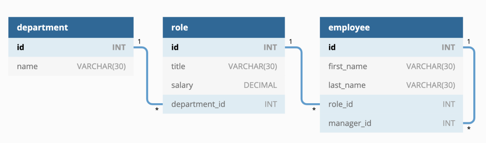

# Employee Tracker 

## Description
This is a command line application which tracks employees at a company.

## Built With
* Node.js
* [mysql2](https://www.npmjs.com/package/mysql2)
* [console.table](https://www.npmjs.com/package/console.table)

## Video Demonstration
https://drive.google.com/file/d/1C2S6UiPKpcCkUbtMnYROC0GOCjxslYpr/view

## Design
Design considerations included:
* Using newer ECMAScript syntax such as the spread operator
* Using syntactic sugar syntax (such as async/await instead of promise chaining) to improve reaability
* Using DRY (Dont Repeat Yourself) software pattern to improve maintainability and readability
* Using separation of concerns
* Database design:

## Contribution
Made with ❤️ by Jason Greenia

